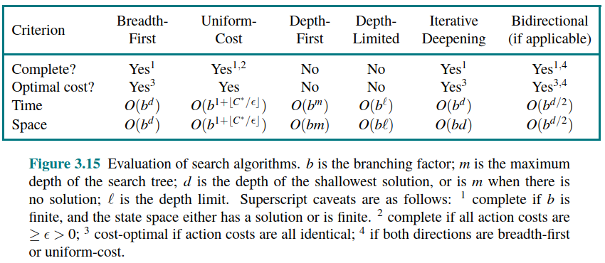

# Graph Search
[Wikipedia](https://en.wikipedia.org/wiki/Graph_traversal)

## Search problems
[Wikipedia](https://en.wikipedia.org/wiki/State_space_search)

A search **problem** can be defined formally by[^ai-modern]:
$$(States, Actions, Cost\ function)$$
- **State space**: a set of possible **states**
  - **Initial state**
  - A set of one or more **goal states**
- **Actions** available to the agent
  
  Actions:
  - $$S_i \rightarrow S_j$$
  - $$OPERATOR(S)$$

  Actions function
  - $$ACTIONS(S)=\{\dots\}$$
- Action cost function
  - Action

    $$COST(O,S_i,S_j)$$
  - Action sequence

## Search algorithms
Evaluation of search algorithms[^ai-modern]:



### Best-first search
Choose the node with minimum value of evaluation function $f(x)$  to expand next from the frontier.

Pesudocode[^ai-modern]:
```
function BEST-FIRST-SEARCH(problem, f ) returns a solution node or failure
  node←NODE(STATE=problem.INITIAL)
  frontier ←a priority queue ordered by f , with node as an element
  reached ←a lookup table, with one entry with key problem.INITIAL and value node
  while not IS-EMPTY(frontier) do
    node←POP(frontier)
    if problem.IS-GOAL(node.STATE) then return node
    for each child in EXPAND(problem, node) do
      s←child.STATE
      if s is not in reached or child.PATH-COST < reached[s].PATH-COST then
        reached[s]←child
        add child to frontier
  return failure

function EXPAND(problem, node) yields nodes
  s←node.STATE
  for each action in problem.ACTIONS(s) do
    s′ ←problem.RESULT(s, action)
    cost ←node.PATH-COST + problem.ACTION-COST(s, action, s′)
    yield NODE(STATE=s′, PARENT=node, ACTION=action, PATH-COST=cost)
```

### Uninformed search algorithms
An **uninformed search algorithm** is given no clue about how close a state is to the goal(s).

Uninformed search algorithms[^ai-modern]:
- Breadth-first search

  We could implement breadth-first search as a call to BEST-FIRST-SEARCH where the evaluation function $f(n)$ is the depth of the node—that is, the number of actions it takes to reach the node.

- Uniform-cost search (Dijkstra's algorithm)

  The evaluation of uniform-cost search is the cost of the path from the root to the current node.

- Depth-first search

  Depth-first search always expands the deepest node in the frontier first. It could be implemented as a call to BEST-FIRST-SEARCH where the evaluation function $f$ is the negative of the depth.

  - Depth-limited search

    To keep depth-first search from wandering down an infinite path, we can use depth-limited search, a version of depth-first search in which we supply a depth limit, $ℓ$, and treat all nodes at depth $ℓ$ as if they had no successors.

    - Iterative deepening search
  
- Bidirectional search

  Bidirectional search simultaneously searches forward from the initial state and backwards from the goal state(s), hoping that the two searches will meet.

### Informed search algorithms
**Informed search algorithms (heuristic search algorithms)** use domain-specific hints about the location of goals and can find solutions more efficiently than unformed search algorithms.

The hints come in the form of a **heuristic function**:
$$h(n)=\text{estimated cost of the cheapest path from the state at node }n\text{ to a goal state}$$

Generating heuristics:
- Generating heuristics from relaxed problems
  - Composite heuristics
- Generating heuristics from subproblems
  - Pattern databases
- Generating heuristics with landmarks
- Learning to search better
- Learning heuristics from experience

Informed search algorithms[^ai-modern]:
- Greedy best-first search

  [Wikipedia](https://en.wikipedia.org/wiki/Best-first_search#Greedy_BFS)

  Greedy best-first search is a form of best-first search that expands first the node with the lowest $h(n)$ value—the node that appears to be closest to the goal—on the grounds that this is likely to lead to a solution quickly. So the evaluation function $f(n) = h(n)$.

- A\* search

  A\* is the most common informed search algorithm. A\* search is a best-first seach that uses the evaluation function
  $$f(n)=g(n)+h(n)$$
  where $g(n)$ is the path cost from the initial state to node $n$, and $h(n)$ is the *estimated cost* of the shortest path from $n$ to a goal state, so we have
  $$f(n)=\text{estimated cost of the best path that continues from }n\text{ to a goal}$$

[^ai-modern]: Russell, Stuart J. Artificial Intelligence a Modern Approach. Pearson Education, Inc.,