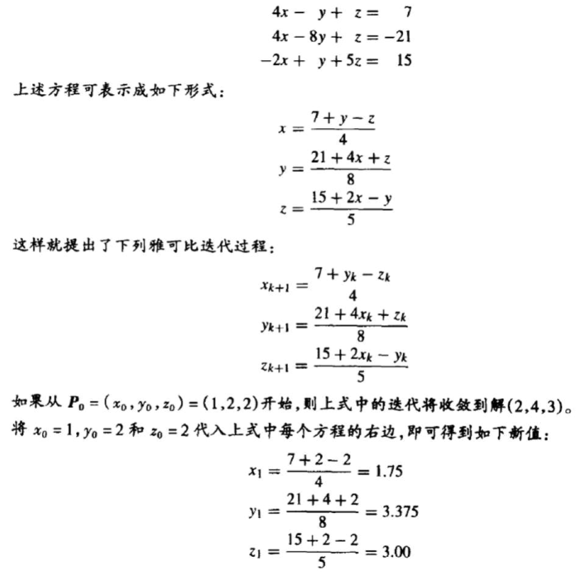

# Jacobi Method
$$\mathbf{A}\mathbf{x}=\mathbf{b}$$

$\mathbf{A}$ can be decomposed into a diagonal component $\mathbf{D}$, a lower triangular part $\mathbf{L}$ and an upper triangular part $\mathbf{U}$:
$$\mathbf{A}=\mathbf{D}+\mathbf{L}+\mathbf{U}$$

The solution is then obtained iteratively via
$$\mathbf{x}^{(k+1)}=\mathbf{D}^{-1} (\mathbf{b}-(\mathbf{L}+\mathbf{U})\mathbf{x}^{(k)})$$

The element-based formula is thus:[^wiki]
$$x_i^{(k+1)}={1\over a_{ii}} (b_i - \sum_{j\ne i} a_{ij}x_j^{(k)}),\quad i=1,2,...,n$$

例子：  

[^wiki]: [Jacobi method - Wikipedia](https://en.wikipedia.org/wiki/Jacobi_method)